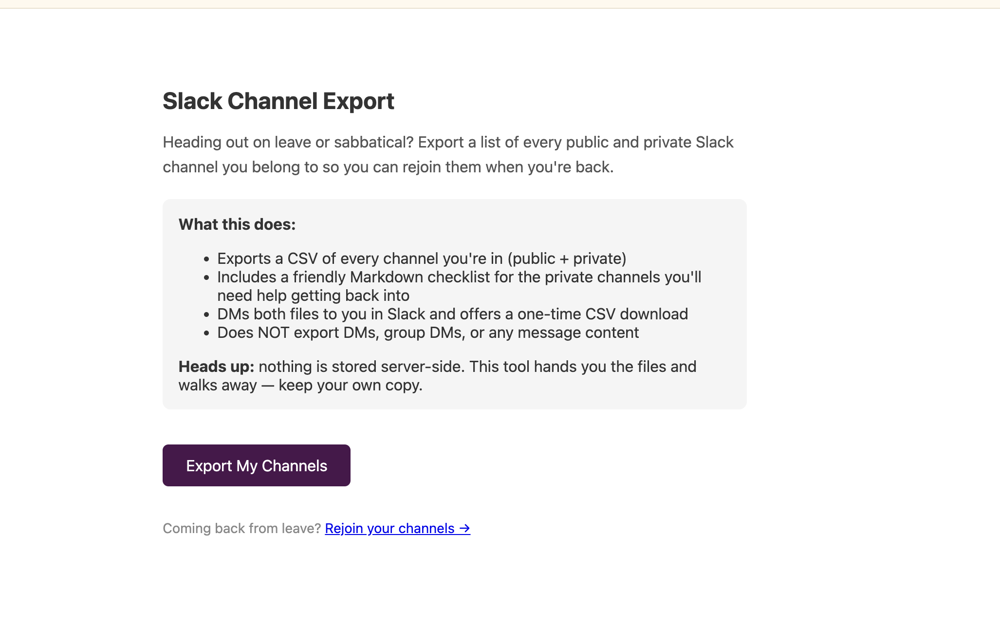
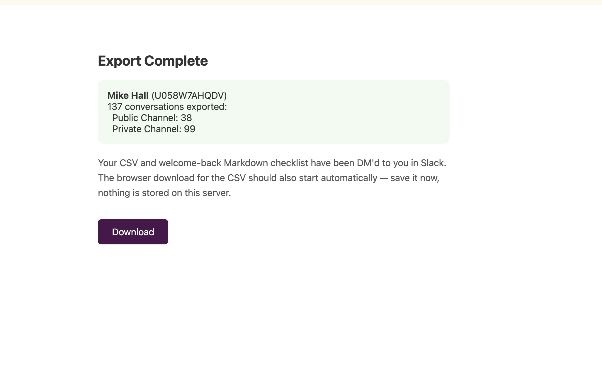
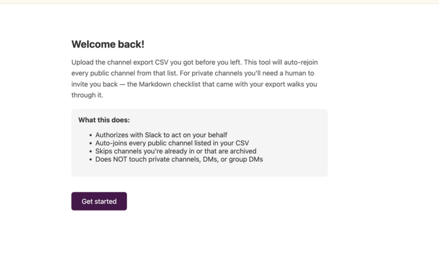
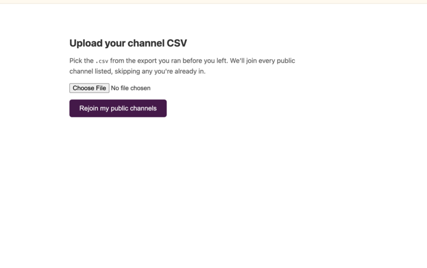
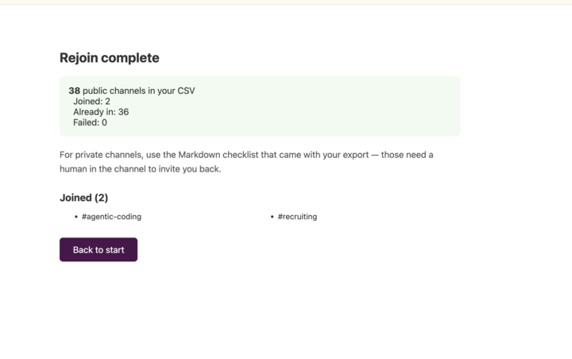

# Slack Channel Export & Rejoin

Self-service tool that helps an employee:

1. **Before going on leave/sabbatical** — export a CSV of every public and private Slack channel they're a member of, plus a friendly Markdown checklist for the private ones, both delivered as a Slack DM to themselves.
2. **When they come back** — auto-rejoin every public channel from that CSV in one click. Private channels still need a human re-invite (Slack's API doesn't allow self-rejoin of private channels).

Nothing is persisted server-side. The user is the sole keeper of their export.

## Architecture in one paragraph

A small Flask app, deployed to a single-instance Google Cloud Run service in `us-west1`. End-user access is gated by Cloud IAP restricted to the `puddingtime.net` Google Workspace. The Slack side is a single OAuth app (User Token Scopes only — no bot) named **ChannelListerator**. Two OAuth flows, two redirect URLs, two distinct scope sets — see [ARCHITECTURE.md](./ARCHITECTURE.md).

## Screenshots

### Export flow

The user lands on `/` and authorizes Slack. The app fetches their channel list, builds a CSV plus a Markdown welcome-back checklist, DMs both files to them, and offers a one-shot browser download.



_Export landing page. The "Rejoin your channels →" link at the bottom points at the companion `/rejoin` flow for when they come back._



_Export completion. Public + private channels only — DMs and group DMs are intentionally out of scope. Nothing is persisted server-side; the user is the sole keeper of their files._

### Rejoin flow

When the user comes back, they hit `/rejoin`, authorize Slack again with a narrower scope set, upload the CSV they saved before they left, and the app auto-joins every public channel from it.



_Rejoin landing page. The smaller scope set (`channels:write` only) is shown on the Slack consent screen the user sees next._



_Upload form after the OAuth callback. A short-lived session cookie (15 min) bridges OAuth → upload so the file POST has the user token waiting for it server-side._



_Rejoin completion. Slack's `conversations.join` returns success with a `warning: already_in_channel` for channels you're already in — the app distinguishes that from a fresh join, so re-running the tool with the same CSV is safe and resumable._

## Routes

| Path | What it does |
|---|---|
| `/` | Landing page for the export flow |
| `/slack/auth` | Kicks off Slack OAuth for export |
| `/slack/callback` | Receives OAuth code, fetches channels, builds CSV + Markdown, DMs both files to the user, offers a one-shot CSV download |
| `/download/<token>` | One-shot, in-memory CSV download (token popped on first GET) |
| `/rejoin` | Landing page for the rejoin flow |
| `/rejoin/auth` | Kicks off Slack OAuth for rejoin (smaller scope set) |
| `/slack/rejoin_callback` | Receives OAuth code, sets a session cookie, redirects to upload form |
| `/rejoin/upload` | GET: file upload form. POST: parses CSV, calls `conversations.join` for each public channel, reports |

## Slack app config

OAuth & Permissions → **User Token Scopes** (this app uses *no* bot token):

| Scope | Used in | Why |
|---|---|---|
| `channels:read` | export | list public channels |
| `groups:read` | export | list private channels |
| `users:read` | export | resolve the user's display name |
| `files:write` | export | upload the CSV + MD as files |
| `im:write` | export | open and write to the user's self-DM |
| `channels:write` | rejoin | `conversations.join` on public channels |

Redirect URLs (must match exactly, no trailing slash):

```
https://<service-url>/slack/callback
https://<service-url>/slack/rejoin_callback
```

## Deploy

One-time per project:

```bash
gcloud config set project mph-gcloud-cli
gcloud config set run/region us-west1

gcloud services enable \
  run.googleapis.com \
  cloudbuild.googleapis.com \
  secretmanager.googleapis.com \
  artifactregistry.googleapis.com \
  iap.googleapis.com

# Secrets — values come from your shell env so they don't get logged
gcloud secrets create slack-client-id --replication-policy=automatic
printf '%s' "$SLACK_CLIENT_ID" | gcloud secrets versions add slack-client-id --data-file=-
gcloud secrets create slack-client-secret --replication-policy=automatic
printf '%s' "$SLACK_CLIENT_SECRET" | gcloud secrets versions add slack-client-secret --data-file=-
# APP_SECRET_KEY signs the OAuth state cookie — generate a fresh value with:
#   python -c 'import secrets; print(secrets.token_urlsafe(32))'
gcloud secrets create app-secret-key --replication-policy=automatic
printf '%s' "$APP_SECRET_KEY" | gcloud secrets versions add app-secret-key --data-file=-

PROJECT_NUMBER=$(gcloud projects describe mph-gcloud-cli --format='value(projectNumber)')
RUNTIME_SA="${PROJECT_NUMBER}-compute@developer.gserviceaccount.com"
for s in slack-client-id slack-client-secret app-secret-key; do
  gcloud secrets add-iam-policy-binding $s \
    --member="serviceAccount:${RUNTIME_SA}" \
    --role="roles/secretmanager.secretAccessor"
done
```

Every deploy:

```bash
gcloud run deploy slack-channel-export \
  --source . \
  --region us-west1 \
  --min-instances 1 \
  --max-instances 1 \
  --memory 512Mi \
  --timeout 3600 \
  --allow-unauthenticated \
  --set-secrets SLACK_CLIENT_ID=slack-client-id:latest,SLACK_CLIENT_SECRET=slack-client-secret:latest,APP_SECRET_KEY=app-secret-key:latest
```

(`--allow-unauthenticated` here means "no Cloud Run IAM auth required" — Cloud IAP is the real gate.)

Enable IAP and restrict to the workspace:

```bash
gcloud beta run services update slack-channel-export --region=us-west1 --iap
gcloud beta iap web add-iam-policy-binding \
  --resource-type=cloud-run --service=slack-channel-export --region=us-west1 \
  --member=domain:puddingtime.net --role=roles/iap.httpsResourceAccessor
```

## Environment variables

- `SLACK_CLIENT_ID` / `SLACK_CLIENT_SECRET` — required. Copy from your Slack app's Basic Information page.
- `APP_SECRET_KEY` — required in production. The app exits at startup if this is
  unset and `FLASK_DEBUG` is not enabled. Signs the short-lived OAuth `state`
  cookie that binds the OAuth callback to the user's browser. Generate one with:
  `python -c 'import secrets; print(secrets.token_urlsafe(32))'`. If
  `FLASK_DEBUG=1` is set and `APP_SECRET_KEY` is unset, an ephemeral key is used
  (dev only — restarts strand in-flight handshakes).
- `APP_ALLOW_INSECURE_COOKIES=1` — local-dev only. Without this, cookies are
  always set with the `Secure` flag. Do not set in production.
- `FLASK_DEBUG=1` — local-dev only. Enables the Werkzeug interactive debugger.
  The dev server only binds to 127.0.0.1, but never set this in any deployment.
  Any truthy spelling works (`1`, `true`, `yes`, `on`); anything else is treated
  as off.
- `LOG_LEVEL` — defaults to `INFO`. Set to `DEBUG` for verbose logs or `WARNING`
  to quiet the OAuth-completion line in production.

OAuth `state` is signed and stored in a short-lived HttpOnly cookie scoped to the flow. No server-side state store is used; the signed cookie itself is the state — binding the OAuth callback to the user's browser and preventing cross-flow reuse.

## Local dev

```bash
python3 -m venv .venv
.venv/bin/pip install -r requirements.txt
export SLACK_CLIENT_ID=...
export SLACK_CLIENT_SECRET=...
export APP_SECRET_KEY=...          # or omit for ephemeral key (dev only)
export APP_ALLOW_INSECURE_COOKIES=1  # required for http://localhost
.venv/bin/python slack_channel_export_selfservice_1.py
# http://localhost:5001
```

Port 5001 (not 5000) because macOS AirPlay Receiver binds 5000 and returns 403.

For local OAuth you need `http://localhost:5001/slack/callback` (and `/slack/rejoin_callback`) added to the Slack app's redirect URLs. Either keep them alongside prod URLs, or swap them in temporarily.

## Project files

```
slack_channel_export_selfservice_1.py   single-file Flask app
requirements.txt                        flask, slack-sdk, gunicorn
Dockerfile                              python:3.12-slim + gunicorn on $PORT
.dockerignore                           keeps .venv, .git, etc. out of the build
ARCHITECTURE.md                         design + threat model for review
CLAUDE.md                               conventions for AI-assisted edits
```
